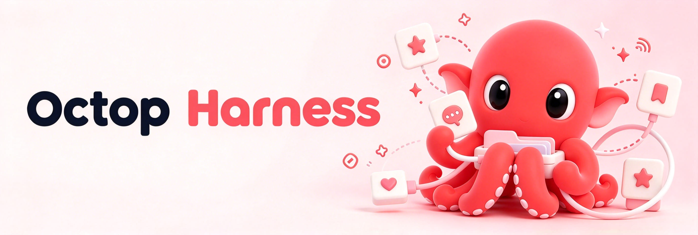

<div align="center">
  
  <h1>Octop Harness</h1>
</div>

<p align="center">
  <strong>基于 Harness Engineering 理念工程化落地的生产级 Agent 运行时。</strong>
</p>

<p align="center">
  <a href="https://www.python.org/downloads/"></a>
  <a href="https://github.com/TencentCloud/octop-harness/blob/main/LICENSE"></a>
  <a href="https://pypi.org/project/octop-harness/"></a>
  <a href="https://github.com/astral-sh/ruff"></a>
  <a href="https://github.com/TencentCloud/octop-harness"></a>
</p>

<p align="center">
  <a href="#什么是-octop-harness">什么是 Octop Harness？</a> ·
  <a href="#为什么选择-octop-harness">为什么选择 Octop Harness？</a> ·
  <a href="#如何使用">如何使用</a> ·
  <a href="#文档">文档</a>
</p>

<p align="center">
  <a href="README.md">English</a> · <b>中文</b>
</p>

---


## 什么是 Octop Harness？

**octop-harness** 是一套基于 Harness Engineering 理论构建的生产级 Agent 运行时。它的核心，是对 [deepagents](https://github.com/langchain-ai/deepagents) 的一层轻量、面向生产的**封装与工程化实践**——基于 deepagents 优雅的 `create_deep_agent` 原语，在其之上包装生产环境真正需要的一切：多供应商模型路由、持久化记忆、浏览器/搜索工具、多 Agent 注册表、可插拔存储后端，以及一个终端 CLI。

> 💜 **致敬 deepagents。** octop-harness 站在 [deepagents](https://github.com/langchain-ai/deepagents)（LangChain 团队出品）的肩膀上。我们的 `HarnessAgent` 最终会委托给 `deepagents.create_deep_agent`，其余——模型路由、后端、分层记忆、Agent 注册表、CLI 与 ACP——都是我们在其之上补充的工程能力。deepagents 提供了智能体的根基，Harness 为它安了一个能落地的"家"。


## 为什么选择 Octop Harness？


|     | 特性                     | 说明                                                                                    |
| --- | ---------------------- | ------------------------------------------------------------------------------------- |
| 🧩  | **构建于 deepagents 之上** | 对 `deepagents.create_deep_agent` 的忠实、生产级封装 —— 致敬 deepagents 项目                       |
| 🔀  | **模型路由**               | `ChatModelFactory` 支持 OpenAI、Anthropic、AWS Bedrock，以及 17 个可编辑的供应商预设                   |
| 🧠  | **持久化记忆**              | 内置 [octop-memory](https://github.com/TencentCloud/octop-memory) 中间件，支持 L0→L3 分层蒸馏 |
| 🛠️ | **丰富工具集**              | 开箱即用的浏览器自动化、网页搜索、文件操作、子 Agent 与 MCP 工具                                                |
| 🗂️ | **多 Agent 注册表**        | `AgentManager` 可在单个进程中托管多个彼此隔离的 Agent                                                 |
| 💾  | **可插拔后端**              | 本地目录、S3、COS 或 PostgreSQL 均可作为 Agent 工作区                                               |
| 🔌  | **ACP 集成**             | 提供 stdio ACP 服务，让 IDE / 终端 AI 直接驱动你的 Agent                                            |
| 🔒  | **安全内建**               | 工具护栏、文件系统权限与敏感信息脱敏                                                                    |
| 💬  | **Teams**              | 面向 Agent 间消息的 peer inbox                                                              |
| ⌨️  | **终端 CLI**             | 交互式对话、供应商 / 技能配置与 Agent 管理                                                            |


### 核心技术


| 层级           | 技术                                                                             |
| ------------ | ------------------------------------------------------------------------------ |
| **语言**       | Python 3.12+                                                                   |
| **Agent 内核** | [deepagents](https://github.com/langchain-ai/deepagents)（`create_deep_agent`） |
| **图运行时**     | LangGraph + SQLite 检查点                                                         |
| **模型路由**     | `ChatModelFactory`（OpenAI / Anthropic / Bedrock + 17 个预设）                      |
| **记忆**       | [octop-memory](https://github.com/TencentCloud/octop-memory) 中间件           |
| **浏览器 / 搜索** | [octop-browser](https://github.com/TencentCloud/octop-browser) + 网页搜索      |
| **工作区**      | `BackendWorkspace`：本地 / S3 / COS / PostgreSQL                                  |
| **ACP**      | agent-client-protocol                                                          |
| **构建 / 质量**  | hatchling · ruff · mypy · pytest                                               |


### 功能特性


#### Agent 运行时

- `HarnessAgentManager` —— 持有 Agent 注册表，可在单个进程中创建、列举与流式调用多个 Agent。
- `HarnessAgent` —— 提供 `call`、`stream`、`stream_events`、`aget_history` 与 `cancel`。
- 通过 LangGraph `AsyncSqliteSaver`（或 octop-memory 检查点）实现可恢复对话。


#### 模型路由与供应商

- `ChatModelFactory` 将模型名解析为对应的客户端。
- 一等供应商：**OpenAI**（含通过 `base_url` 兼容的 OpenAI 接口）、**Anthropic**、**AWS Bedrock**（可选 `[bedrock]` 扩展）。
- 17 个可编辑的供应商预设，含混元、Kimi、GLM、DeepSeek、MiniMax、Moonshot 等。


#### 分层记忆

- 每一轮对话先记录为 **L0 原始事件**，再异步蒸馏为 **L2 原子**（`AtomCard`）与 **L3 实体页**。
- 由 octop-memory 中间件驱动，记忆随工作区一同迁移。


#### 工具与技能

- 内置工具：浏览器（octop-browser）、网页搜索、文件、子 Agent 与 MCP 工具。
- 技能来自 deepagents 的 skills 中间件，可通过 CLI 按 Agent 管理。


#### 多 Agent 与协作

- 通过 `AgentManager` + `registry` 在单进程内托管多个隔离 Agent。
- **Teams** peer inbox 用于 Agent 间消息互通。
- **ACP** stdio 服务，供外部 IDE / 终端 AI 调用你的 Agent。


#### 安全

- `SecurityPolicy` 提供工具护栏、文件系统权限（`FilesystemPermission`）与敏感信息脱敏中间件。


#### CLI

`octop-harness` 提供：`init`、`chat`、`agent`、`config`（如 `config provider add`）、`skill`、`update`。

## 如何使用


### 环境要求

- **Python 3.12+**
- 一个模型供应商的 API Key（OpenAI / Anthropic / Bedrock / 兼容接口）


### 1. 安装

```bash
# 核心 SDK —— Agent 运行时、模型路由、工具、技能、后端
pip install octop-harness

# 附带终端 CLI —— 交互式对话、配置、技能管理
pip install octop-harness[cli]

# 多个 extras —— 同一对方括号内用逗号分隔（建议给 shell 加引号）：
pip install 'octop-harness[object-storage,desktop]'
pip install 'octop-harness[cli,all]'
```

按需安装的 optional extras（缺包时在用到对应功能时才会报错并提示安装命令）：


| Extra             | 用途                                                       |
| ----------------- | -------------------------------------------------------- |
| `cli`             | 终端 CLI（`octop-harness`）                                  |
| `bedrock`         | AWS Bedrock 供应商                                          |
| `object-storage`  | 腾讯云 COS + 阿里云 OSS + 华为云 OBS SDK                          |
| `desktop`         | 桌面截图 / 键鼠（`mss`、`pynput`、`pillow`）                       |
| `web-search-all`  | 全部网页搜索后端（Tavily / Brave / Google）                        |
| `remote-backends` | 经 `deepagents-backends` 的 Postgres / 上游 S3（Python ≥3.12） |
| `observability`   | Langfuse                                                 |
| `acp`             | ACP agent runner                                         |
| `all`             | 上面全部**库功能** extras（**不含** `cli`；两者都要则用 `[cli,all]`）      |


### 2. 初始化与配置

```bash
octop-harness init
octop-harness config provider add   # 选择供应商并粘贴你的 Key
```


### 3. 对话

```bash
octop-harness chat
```


### 编程式使用

```python
from octop_harness import HarnessAgentManager, HarnessAgentConfig, ProviderConfig, ChatRequest

manager = HarnessAgentManager()
agent: HarnessAgentConfig = manager.create_agent(
    name="assistant",
    provider=ProviderConfig(name="openai", api_key="sk-..."),
    model="gpt-4o",
)
request = ChatRequest(message="用一段话总结 Harness 理论。")
async for chunk in agent.stream(request):
    print(chunk.delta, end="")
```


## 文档

- [什么是 Octop Harness？](#什么是-octop-harness)
- [为什么选择 Octop Harness？](#为什么选择-octop-harness)
- [如何使用](#如何使用)
- [文档](#文档)


### CLI 参考


| 命令                     | 说明                                |
| ---------------------- | --------------------------------- |
| `octop-harness init`   | 初始化工作区与配置                         |
| `octop-harness chat`   | 与 Agent 交互式对话                     |
| `octop-harness agent`  | 创建、列举与管理 Agent                    |
| `octop-harness config` | 供应商 / 模型配置（`config provider add`） |
| `octop-harness skill`  | 按 Agent 启用 / 停用技能                 |
| `octop-harness update` | 检查并安装更新                           |


### 项目结构

```
src/octop_harness/
  agent.py          对 deepagents.create_deep_agent 的封装门面
  manager.py        AgentManager —— 多 Agent 注册表
  config/           配置、供应商与模型预设
  llm/factory.py    ChatModelFactory —— 模型路由
  backends/         BackendWorkspace —— 本地 / S3 / COS / Postgres
  builtin/          工具 + 技能 + 种子文件
  middleware/       model_router, skill_filter, tool_guard, memory, pii, ...
  memory/           MemoryRuntime（octop-memory 封装）
  protocols/        langgraph / openai / mcp 流式协议
  acp/              ACP stdio 服务
  teams/            peer inbox
  cli/              终端 CLI
```


### 开发

**环境要求：** Python 3.12+、[uv](https://docs.astral.sh/uv/)

```bash
make install          # pip install -e ".[cli,dev]"
make all              # 格式化 + 类型检查 + 测试
```


## 🤝 贡献

1. Fork 本仓库
2. 创建特性分支（`git checkout -b feature/amazing-feature`）
3. 提交前运行 `make all`
4. 向 `main` 发起 Pull Request

模块边界与编码规范见 [AGENTS.md](AGENTS.md)。

分支、PR 与发版流程见 [CONTRIBUTING.md](CONTRIBUTING.md)（`release/*` → `main` 合并后自动发布到 PyPI）。

## 🔗 相关项目


| 项目                                                                 | 说明                               |
| ------------------------------------------------------------------ | -------------------------------- |
| [deepagents](https://github.com/langchain-ai/deepagents)           | Harness Agent 所封装的智能体根基 —— ❤️ 致敬 |
| [octop-memory](https://github.com/TencentCloud/octop-memory)   | 支撑分层记忆的记忆系统                      |
| [octop-browser](https://github.com/TencentCloud/octop-browser) | Agent 使用的 CDP 浏览器自动化             |
| [octop-gateway](https://github.com/TencentCloud/octop-gateway) | 多平台 IM 通道桥接                      |
| [Octop](https://github.com/TencentCloud/Octop)                     | 组合 Harness 技术栈的自托管助手             |


## 📄 许可证

本项目基于 [MIT 许可证](LICENSE) 开源。

## ✨ 贡献者

感谢所有贡献者：

<a href="https://github.com/TencentCloud/octop-harness/graphs/contributors">
  
</a>
